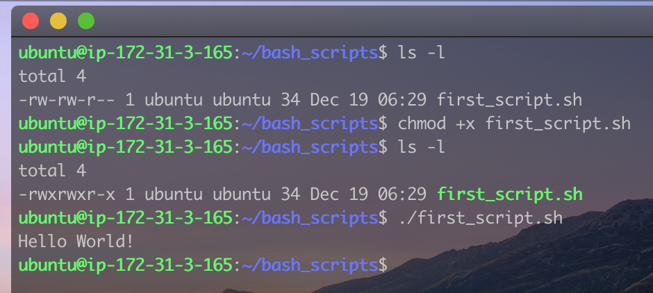
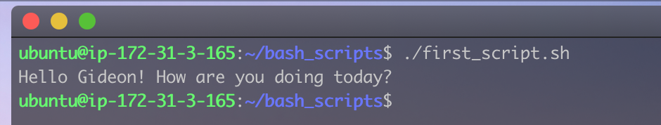
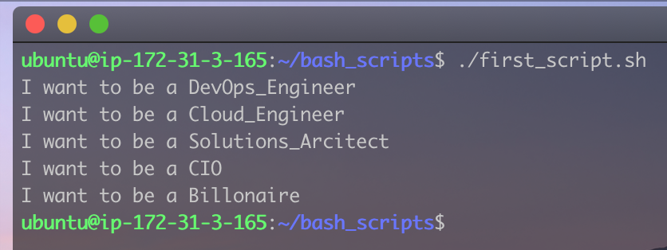
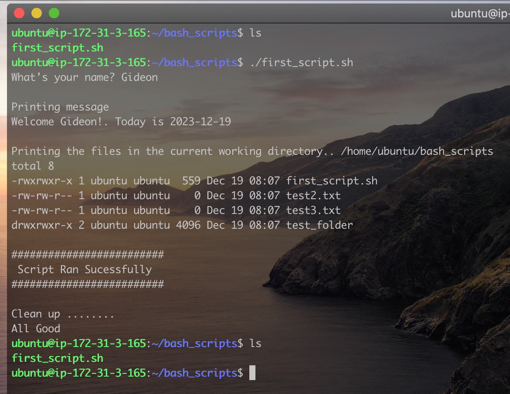
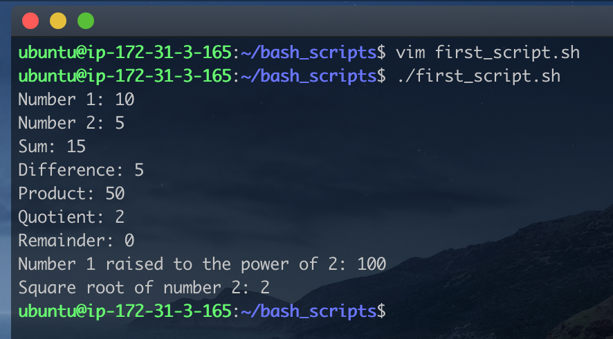
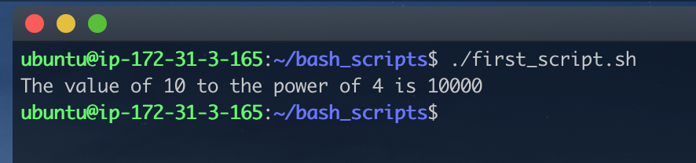
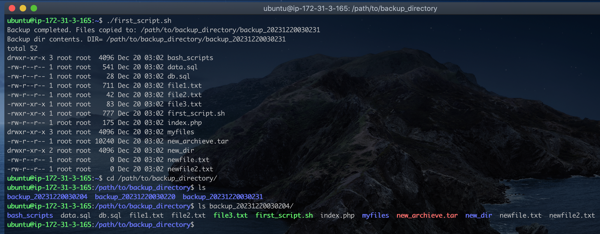

# Task Automation with Bash Scripting

A Bash script is a plain text file containing series of commands written in the Bash (Bourne Again SHell) scripting language. Bash is a widely used as it provides a powerful and flexible way to automate tasks and execute commands. Bash scripts often have the ".sh" file extension and can be run from the command line to automate repetitive tasks or perform system administration tasks.  
In this project, we will get familair with how a bash script works.

### Part 1 - Basic commands

Bash scripts are ususally saved with the `.sh` extension. Lets create our first script:

- Open create a file with your favorite text editor and then write the code below:

  > ```bash
  > #! /bin/bash
  >
  > echo "Hello World!"
  > Save the file as `first_script.sh`then run the following commands:
  > ```

  - `chmod +x first_script.sh`: to make it executable
  - `./first_script.sh`: To run the script.
    
    We just created and ran our first bash script.

- **Variables**  
  Just like any other programming language, we can create variables in bash. Here is an example:

  > ```bash
  > #! /bin/bash
  >
  > name="Gideon"
  > echo "Hello $name! How are you doing today?"
  > ```
  >
  > As with the previous example, make sure the file is saved with a `.sh` extension, and is executable. Run the script and you should see the output below:

  
  Now, let's do something more interesting.

- **Conditional Statements**  
  Conditional statements like _if if else if elif else_ are very important and powerful when writing a script. They allow for decision-making based on certain conditions, executing specific code blocks if the conditions are met or bypassing them if not. Let's look at some examples.

  > ```bash
  > #!/bin/bash
  >
  > # Example script to check if a number is positive, negative, or zero
  >
  > read -p "Enter a number: " num
  >
  > if [ $num -gt 0 ]
  >   then
  >       echo "The number $num is positive."
  > elif [ $num -lt 0 ]
  >    then
  >       echo "The number $num is negative."
  > elif [ $num -eq 0]
  >       echo "The number $num is zero."
  > else
  >       echo "$num is not a valid number"
  > fi
  > ```

  - The `read -p` is used to propmt the user of an input.
  - The `if` block check if the number provided by the user is greater than zero. If the number is greater than zero, then the first condition is met and it prints out `The number is positive`.
  - The `elif` checks if the number is less than 0. It is important to note that if the first condition is met, the code won't bother checking for other conditions. The `elif` block will only run if the number is not greater than zero.
  - And finally, the `else` block will only run if all the conditions definded above evaluted to false.

- **Loop**  
   Loop statements in programming allow for the repetition of a set of instructions, enabling efficient execution of tasks by iterating through code multiple times. The commonly used loops are `for loops` and `while loops`

  > ```bash
  > #! /bin/bash
  >
  > # For loop: A simple script to print 10 to 20
  >
  > for (( i=10; i<=20; i++))
  >     do
  >         echo $i
  > done
  > ```

  - `i=10`: assigns 10 to the variable `i`.
  - `i<=20`: tells the loop that `i` should not be greater than 20.
  - `i++`: tells the script to increament `i` by 1. This defines the control of the loop.

  We also have a variant of the `for loop` called `for each`.

  > ```bash
  > #! /bin/bash
  >
  > # For each: Used to itrate through a list or other iteratable objects.
  >
  > ROLES="DevOps_Engineer Cloud_Engineer Solutions_Arcitect CIO Billonaire"
  >
  > for role in $ROLES
  >     do
  >         echo "I want to be a $role"
  > done
  > ```
  >
  > 

  This code iterates through all the roles specified in the `ROLES` variable, and then prints "I want to be a ", the role in each iteration. This can be very useful when configuring a files with different values.

  As said in the dfination of a bash script, almost if not all linux commands can be used in a bash script. let's write a script the performs multiple random operations:

  > ```bash
  > #! /bin/bash
  >
  > # Get the user's name and send a greeting
  > read -p "What's your name? " name
  > today=$(date +%Y-%m-%d)
  >
  > # Create a Directory and some sets of files
  > mkdir test_folder
  > touch test_file.txt test2.txt test3.txt
  >
  > #Print a messages with the user's name and today's date. Save the output to a file
  > echo "Welcome $name!. Today is $today" > test_file.txt
  >
  > # Move the file into the folder, then print the content of the file inside the folder
  > mv test_file.txt test_folder/
  > echo " "
  > echo "Printing message"
  > cat test_folder/test_file.txt
  > echo " "
  >
  >
  > echo "Printing the files in the current working directory.. $PWD"
  > ls -l
  > echo " "
  > echo "#########################"
  > echo " Script Ran Sucessfully"
  > echo "#########################"
  > echo " "
  > echo "Clean up ........"
  >
  > # Delete all files and folder created
  > rm test2.txt test3.txt
  > rm -rf test_folder/
  > echo "All Good"
  > ```

  

  From the image above, the script ran sucessfully and in the process, created few files and a folder. However, towards the end of the script, all the files and folders were deleted.  
  This is just an example of how we can combine multiple commands to automate a task in linux.  
   The tasks could be as simple as creating or deleting a file to something as complex as downloading ngix, installing and configuring a database and then deploying a web site.

### Part 2 - Directory Manipulation and Navigation

In this section, we will be building up on where we stopped in the last script. We will do more direction manipulation and navigation using bash script.

> ```bash
> #!/bin/bash
>
> # Display current directory
> echo "Current directory: $PWD"
>
> # Create a new directory
> echo "Creating a new directory..."
> mkdir my_directory
> echo "New directory created."
>
> # Change to the new directory
> echo "Changing to the new directory..."
> cd my_directory
> echo "Current directory: $PWD"
>
> # Create some files
> echo "Creating files..."
> touch file1.txt
> touch file2.txt
> echo "Files created."
>
> # List the files in the current directory
> echo "Files in the current directory:"
> ls
>
> # Move one level up
> echo "Moving one level up..."
> cd ..
> echo "Current directory: $PWD"
>
> # Remove the new directory and its contents
> echo "Removing the new directory..."
> rm -rf my_directory
> echo "Directory removed."
>
> # List the files in the current directory again
> echo "Files in the current directory:"
> ls
>
> ```
>
> Save and run the script.

### Part 3 - File Operations and Sorting

Just as we've seen how can can manipulate and navigate directories in bash scripting, we will be performing some file operation and sorting in this exercise. With a bash script, we can automate tasks such as coping and deleting files, renaming files, checking if a file exists or not, appending and deleting contents of a file, finding files by their extension, changing permissions of a file etc. As you can see, we can do almost operation using bash scripting.

> ```bash
> #!/bin/bash
>
> # Create three files
> echo "Creating files..."
> echo "This is file3." > file3.txt
> echo "This is file1." > file1.txt
> echo "This is file2." > file2.txt
> echo "Files created."
>
> # Display the files in their current order
> echo "Files in their current order:"
> ls
>
> # Sort the files alphabetically
> echo "Sorting files alphabetically..."
> ls | sort > sorted_files.txt
> echo "Files sorted."
>
> # Display the sorted files
> echo "Sorted files:"
> cat sorted_files.txt
>
> # Remove the original files
> echo "Removing original files..."
> rm file1.txt file2.txt file3.txt
> echo "Original files removed."
>
> # Rename the sorted file to a more descriptive name
> echo "Renaming sorted file..."
> mv sorted_files.txt sorted_files_sorted_alphabetically.txt
> echo "File renamed."
>
> # Display the final sorted file
> echo "Final sorted file:"
> cat sorted_files_sorted_alphabetically.txt
>
> ```

### Part 4 - Working with Numbers and Calculations

Just like other programming languages, we can perfome basic calulations with bash script.

> ```bash
> #!/bin/bash
>
> # Define two variables with numeric values
> num1=10
> num2=5
>
> # Perform basic arithmetic operations
> sum=$((num1 + num2))
> difference=$((num1 - num2))
> product=$((num1 * num2))
> quotient=$((num1 / num2))
> remainder=$((num1 % num2))
>
> # Display the results
> echo "Number 1: $num1"
> echo "Number 2: $num2"
> echo "Sum: $sum"
> echo "Difference: $difference"
> echo "Product: $product"
> echo "Quotient: $quotient"
> echo "Remainder: $remainder"
>
> # Perform some more complex calculations
> power_of_2=$((num1 ** 2))
> square_root=$(echo "sqrt($num2)" | bc)
>
> # Display the results
> echo "Number 1 raised to the power of 2: $power_of_2"
> echo "Square root of number 2: $square_root"
>
> ```
>
> 

The script above performed different arithmetic calculations using two interger variables. Bash scripting also support functions. For example

> ```bash
> #! /bin/bash
>
> num1=10
> num2=4
> value=$((num1 ** num2))
>
> # function to calculate the value of num1 to the nth num2 power
>
> function power(){
>      echo "The value of $num1 to the power of $num2 is $value"
> }
>
> power
> ```
>
> 

### Part 5 - File Backup and Timestamp

Backing up files is crucial to safeguard against data loss caused by accidental deletion, hardware failure, or other unforeseen events. Timestamping backups adds an additional layer of importance by providing a chronological record, aiding in version control and enabling the restoration of files to specific points in time for effective data management and recovery.  
This very importanct task can be accomplished using a simple bash script.

> ```bash
> #! /bin/bash
>
> # Define the source directory and backup directory
> #source_dir="/path/to/source_directory"
> source_dir=$PWD
> backup_dir="/path/to/backup_directory"
>
> # Create a timestamp with the current date and time
> timestamp=$(date +"%Y%m%d%H%M%S")
>
> # Create a backup directory with the timestamp
> backup_dir_with_timestamp="$backup_dir/backup_$timestamp"
>
> # Create the backup directory
> sudo mkdir -p "$backup_dir_with_timestamp"
>
> # Copy all files from the source directory to >the backup directory
> sudo cp -r "$source_dir"/* "$backup_dir_with_timestamp"
>
> # Display a message indicating the backup process is complete
> echo "Backup completed. Files copied to: $backup_dir_with_timestamp"
> echo "Backup dir contents. DIR=" $backup_dir_with_timestamp
> ls -l $backup_dir_with_timestamp
>
> ```

- Run the above script multiple times to create different backup folders with unique timestamps.
- Navigate to the backup directory to see the list of backup folders created
- list the content of any of the directory. All files from our intitial home working directory are now backed up at that location.



**So these and many more powerful automation tasks can be archieve using a simple bash script**.
